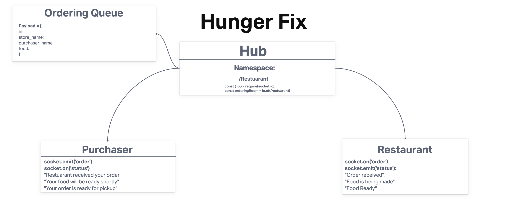

# Hunger-fix-messenger

## Authors

    * [Arturo Valadez](https://github.com/Arturovaladez1), 
    * [Thomas Lau](https://github.com/Rapib), 
    * [Phil Chapman](https://github.com/pchapl1), 
    * [Kameron Watts](https://github.com/KamWatts)

## Problem Domain

The goal of Hunger Fix is to decrease wait times once a client comes to pick up an order at a restuarant. Clients are updated on the status of their order once its placed. Updates include when the order is being processed, cooked, and ready for pickup.

Stretch goals include:

    * Providing real-time traffic data that references the quickest route to get to the restaurant and features the average time it takes the restaurant to process order to completion so clients can time their arrival to pick up the order in a punctual manner. 
    * An intercactive map that shows the routes
    * Ability to add more to an order after it's been processed

## Project UML

